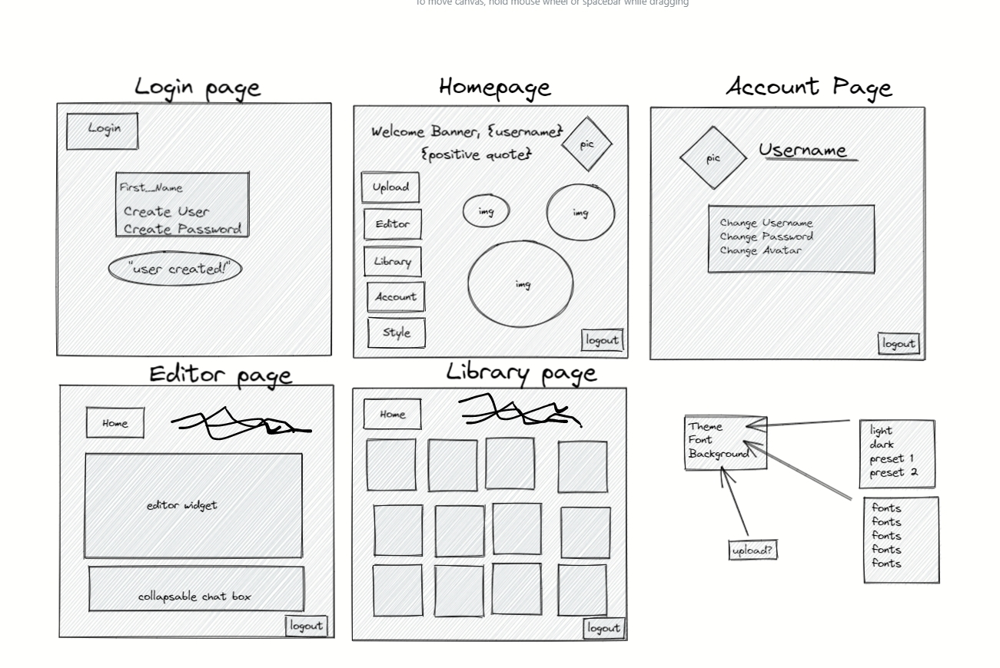

# [Project #2 - FotoFoto Library](https://fotofotolibrary.herokuapp.com/)

---

# Description

Welcome to the FotoFoto library, a full-stack image library and robust photo-editing platform that aims to be a fun and simple way for users to upload their own photos and add a touch of personalization. This application also enables users to store their customized photos into their personal library and includes all the tools one can expect from a photo editing program, such as cropping, the ability to adjust brightness and contrast, and much more!

Our goal is to help users explore their creative side by offering a balance between simplicity and in-depth editing all within one easy-to-use application.

Check out our deployed project [here](https://fotofotolibrary.herokuapp.com/)! 

&nbsp;

---
# Table of Contents

  - [Description](#description)
  - [Table of Contents](#table-of-contents)
  - [Installation](#installation)
  - [Usage](#usage)
  - [Technologies Used](#technologies-used)
  - [Acceptance-Criteria](#acceptance-criteria)
  - [Demo](#demo)
  - [Screenshots](#screenshots)
  - [Contributing](#contributing)
  - [Contact](#contact)
  - [License](#license)

&nbsp;

---
# Installation

Instructions: 
1. Fork the application repository from GitHub and clone this project to your machine.
2. Open the project with your preferred text-editor, such as VS code.
3. Prerequisite installations: Node.js, MySQL.
4. This project includes a `package.json` file that specifies dependencies for this project, which can be installed by running the command `"npm install"`.

&nbsp;

---
# Usage

Once the project has been installed:
1. Open the project file within your terminal
2. Run command `"mysql -u root -p"` and enter your password (note: keystrokes will not show).
3. Run command `"SOURCE schema.sql"` followed by `"USE fotofoto_db"` to set up the database and tables.
4. Create a file called `.env` in the root folder of the program. In this folder include the following information:  
  - `DB_NAME = 'fotofoto_db'`
  - `DB_USER = 'your username'`
  - `DB_PASSWORD = 'your password'`
  - `SESSION_SECRET = 'your session secret'`
5. Open the "server.js" file in your integrated terminal.
6. Run command `"npm run seed"` to seed the database.
7. Run command `"npm run start"` to start the server.
8. Open `'localhost:3000'` in your preferred browser.
9. Sign up as a new user and upload/edit images as desired.
10. When finished, run command `CONTROL-C` in the terminal to end the session.

&nbsp;

---
# Technologies Used

General Technologies: 
- [HTML](https://html.com/)
- [CSS](https://developer.mozilla.org/en-US/docs/Web/CSS)
- [Javascript](https://www.javascript.com/)
- [Node](https://www.npmjs.com/package/node)
- [Heroku](https://www.heroku.com/)
- [UIKit](https://getuikit.com/)
- [ToastUIEditor](https://ui.toast.com/tui-editor)
- [Cloudinary](https://cloudinary.com/)
- [Codepen](https://codepen.io/)

NPM Packages
- [connect-session-sequelize](https://www.npmjs.com/package/connect-session-sequelize)
- [express-handlebars](https://www.npmjs.com/package/express-handlebars)
- [express-session](https://www.npmjs.com/package/express-session)
- [nodemon](https://www.npmjs.com/package/nodemon) 
- [Express](https://www.npmjs.com/package/express)
- [dotenv](https://www.npmjs.com/package/dotenv)
- [MySQL2](https://www.npmjs.com/package/mysql)
- [Sequelize](https://www.npmjs.com/package/sequelize)
- [bcrypt](https://www.npmjs.com/package/bcrypt)
- [filesaver](https://www.npmjs.com/package/file-saver)

&nbsp;

---
# Acceptance-Criteria
Project requirements:
- Must use a Node and Express web server
- Must be backed by a MySQL database with a Sequelize ORM 
- Must have both GET and POST routes for retrieving and adding new data
- Must be deployed with heroku (with data)
- Must utilize at least one new library, package or technology that we haven't discussed
- Must have a front end/UI utilizing Handlebars
- Must have a folder structure that meets the MVC paradigm
- Must include authentication (sessions and cookies)
- Must protect API keys in Node with environmental variables

&nbsp;

---
# Demo

## Homepage

## Uploading an image

## Editing an image

## Updating account

&nbsp;

---
# Screenshots

## Wireframe

## Sign Up Page

## Homepage

## Library

## Editor

&nbsp;

---
# Contributing

This project was completed as a collaborative group for Project 2 from the University of Washington Web Development Bootcamp. If you would like to contribute, please feel free to contact any of the team members with questions or comments.

&nbsp;

---
# Credits
- [Codepen](https://codepen.io/) - animated backgrounds
- [UIKit](https://getuikit.com/) - CSS framework
- [ToastUIEditor](https://ui.toast.com/tui-editor) - image-editing platform
- [Cloudinary](https://cloudinary.com/) - image-uploading platform
- 

---
# Contact

If you have any questions feel free to contact our team:
- Dahlia Graves | [Github](https://github.com/DahliaGRV) | [email](Dahliag@uw.edu)
- Lucas Roman | [Github](https://github.com/remotemana) | [email](lucas.e.roman@gmail.com)
- Joe Choe | [Github](https://github.com/jchoe125) | [email](joechoe125@gmail.com)
- Yi Jin | [Github](https://github.com/kayjinyi) | [email](kayjinyi@gmail.com)

&nbsp;

---
## License

[MIT License](./LICENSE) 

Copyright (c) 2022

Permission is hereby granted, free of charge, to any person obtaining a copy
of this software and associated documentation files (the "Software"), to deal
in the Software without restriction, including without limitation the rights
to use, copy, modify, merge, publish, distribute, sublicense, and/or sell
copies of the Software, and to permit persons to whom the Software is
furnished to do so, subject to the following conditions:

The above copyright notice and this permission notice shall be included in all
copies or substantial portions of the Software.

THE SOFTWARE IS PROVIDED "AS IS", WITHOUT WARRANTY OF ANY KIND, EXPRESS OR
IMPLIED, INCLUDING BUT NOT LIMITED TO THE WARRANTIES OF MERCHANTABILITY,
FITNESS FOR A PARTICULAR PURPOSE AND NONINFRINGEMENT. IN NO EVENT SHALL THE
AUTHORS OR COPYRIGHT HOLDERS BE LIABLE FOR ANY CLAIM, DAMAGES OR OTHER
LIABILITY, WHETHER IN AN ACTION OF CONTRACT, TORT OR OTHERWISE, ARISING FROM,
OUT OF OR IN CONNECTION WITH THE SOFTWARE OR THE USE OR OTHER DEALINGS IN THE
SOFTWARE.